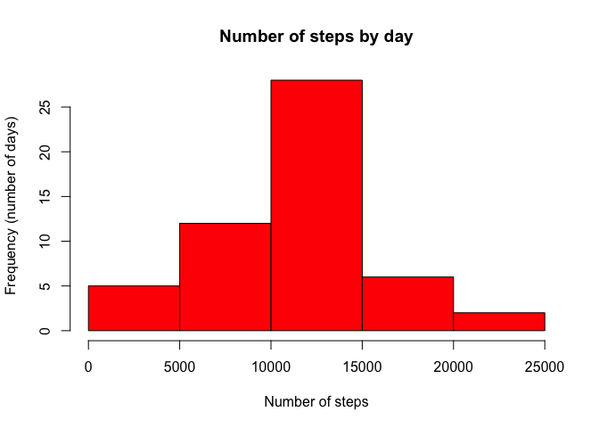
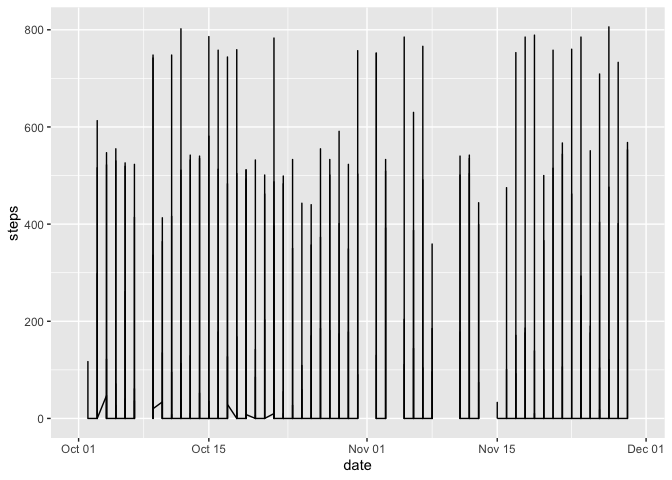
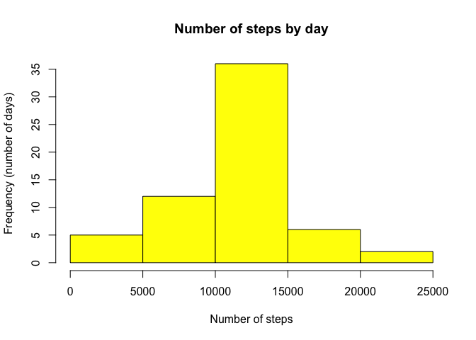
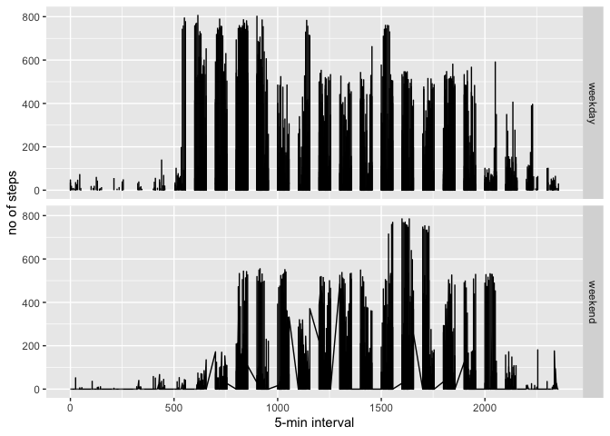

## Loading and preprocessing the data

```r
#reading data
activity <- read.csv("activity.csv")
summary(activity)
```

```
##      steps            date              interval     
##  Min.   :  0.00   Length:17568       Min.   :   0.0  
##  1st Qu.:  0.00   Class :character   1st Qu.: 588.8  
##  Median :  0.00   Mode  :character   Median :1177.5  
##  Mean   : 37.38                      Mean   :1177.5  
##  3rd Qu.: 12.00                      3rd Qu.:1766.2  
##  Max.   :806.00                      Max.   :2355.0  
##  NA's   :2304
```

```r
summary(activity$steps)
```

```
##    Min. 1st Qu.  Median    Mean 3rd Qu.    Max.    NA's 
##    0.00    0.00    0.00   37.38   12.00  806.00    2304
```

```r
#processing data
activity$date <- as.Date(activity$date)
stepsbydate <- aggregate(activity$steps,
                         by=list(activity$date)
                         ,sum)
summary(stepsbydate)
```

```
##     Group.1                 x        
##  Min.   :2012-10-01   Min.   :   41  
##  1st Qu.:2012-10-16   1st Qu.: 8841  
##  Median :2012-10-31   Median :10765  
##  Mean   :2012-10-31   Mean   :10766  
##  3rd Qu.:2012-11-15   3rd Qu.:13294  
##  Max.   :2012-11-30   Max.   :21194  
##                       NA's   :8
```

## What is the mean total number of steps taken per day?

1. Histogram of the total number of steps taken each day


```r
#Total no. of steps taken each day 
hist(stepsbydate$x,
              main="Number of steps by day", 
              xlab="Number of steps", 
              ylab="Frequency (number of days)", 
              col="red")
```

<!-- -->

2. Mean and median total number of steps taken per day


```r
mean(stepsbydate$x,na.rm = TRUE)
```

```
## [1] 10766.19
```

```r
median(stepsbydate$x,na.rm = TRUE)
```

```
## [1] 10765
```

## What is the average daily activity pattern?

1.Make a time series plot (i.e. type = "l") of the 5-minute interval (x-axis) and the average number of steps taken, averaged across all days (y-axis)

```r
#option1
#p1<- plot(activity$date, activity$steps, 
#          type = "l", 
#          main = "Avg number of steps taken across all days",
#          xlab = "date",ylab="steps")
#p1

#option2
library(ggplot2)
p<- ggplot(activity, aes(x=date, y=steps)) +
          geom_line()
p
```

```
## Warning: Removed 576 row(s) containing missing values (geom_path).
```

<!-- -->

2.Which 5-minute interval, on average across all the days in the dataset, contains the maximum number of steps?


```r
library(magrittr)
library(dplyr)
```

```
## 
## Attaching package: 'dplyr'
```

```
## The following objects are masked from 'package:stats':
## 
##     filter, lag
```

```
## The following objects are masked from 'package:base':
## 
##     intersect, setdiff, setequal, union
```

```r
activity %>% group_by("steps") %>% slice(which.max(steps))
```

```
## # A tibble: 1 x 4
## # Groups:   "steps" [1]
##   steps date       interval `"steps"`
##   <int> <date>        <int> <chr>    
## 1   806 2012-11-27      615 steps
```

## Imputing missing values

1. Calculate and report the total number of missing values in the dataset (i.e. the total number of rows with NAs)


```r
summary(activity)
```

```
##      steps             date               interval     
##  Min.   :  0.00   Min.   :2012-10-01   Min.   :   0.0  
##  1st Qu.:  0.00   1st Qu.:2012-10-16   1st Qu.: 588.8  
##  Median :  0.00   Median :2012-10-31   Median :1177.5  
##  Mean   : 37.38   Mean   :2012-10-31   Mean   :1177.5  
##  3rd Qu.: 12.00   3rd Qu.:2012-11-15   3rd Qu.:1766.2  
##  Max.   :806.00   Max.   :2012-11-30   Max.   :2355.0  
##  NA's   :2304
```
Total NA's   :2304

2. Devise a strategy for filling in all of the missing values in the dataset. The strategy does not need to be sophisticated. For example, you could use the mean/median for that day, or the mean for that 5-minute interval, etc.
3. Create a new dataset that is equal to the original dataset but with the missing data filled in.


```r
library(psych)
```

```
## 
## Attaching package: 'psych'
```

```
## The following objects are masked from 'package:ggplot2':
## 
##     %+%, alpha
```

```r
acti <- activity 
acti$steps[is.na(acti$steps)]<-mean(acti$steps,na.rm=TRUE)
describe(acti)
```

```
## Warning in FUN(newX[, i], ...): no non-missing arguments to min; returning Inf
```

```
## Warning in FUN(newX[, i], ...): no non-missing arguments to max; returning -Inf
```

```
##          vars     n    mean     sd median trimmed    mad min  max range skew
## steps       1 17568   37.38 104.39    0.0   11.81   0.00   0  806   806 4.47
## date        2 17568     NaN     NA     NA     NaN     NA Inf -Inf  -Inf   NA
## interval    3 17568 1177.50 692.45 1177.5 1177.50 889.56   0 2355  2355 0.00
##          kurtosis   se
## steps       21.67 0.79
## date           NA   NA
## interval    -1.20 5.22
```

```r
describe(activity)
```

```
## Warning in FUN(newX[, i], ...): no non-missing arguments to min; returning Inf

## Warning in FUN(newX[, i], ...): no non-missing arguments to max; returning -Inf
```

```
##          vars     n    mean     sd median trimmed    mad min  max range skew
## steps       1 15264   37.38 112.00    0.0     8.0   0.00   0  806   806 4.17
## date        2 17568     NaN     NA     NA     NaN     NA Inf -Inf  -Inf   NA
## interval    3 17568 1177.50 692.45 1177.5  1177.5 889.56   0 2355  2355 0.00
##          kurtosis   se
## steps       18.43 0.91
## date           NA   NA
## interval    -1.20 5.22
```

```r
#new dataset
stepsbydate2 <- aggregate(acti$steps,
                         by=list(acti$date)
                         ,sum)
stepsbydate2
```

```
##       Group.1        x
## 1  2012-10-01 10766.19
## 2  2012-10-02   126.00
## 3  2012-10-03 11352.00
## 4  2012-10-04 12116.00
## 5  2012-10-05 13294.00
## 6  2012-10-06 15420.00
## 7  2012-10-07 11015.00
## 8  2012-10-08 10766.19
## 9  2012-10-09 12811.00
## 10 2012-10-10  9900.00
## 11 2012-10-11 10304.00
## 12 2012-10-12 17382.00
## 13 2012-10-13 12426.00
## 14 2012-10-14 15098.00
## 15 2012-10-15 10139.00
## 16 2012-10-16 15084.00
## 17 2012-10-17 13452.00
## 18 2012-10-18 10056.00
## 19 2012-10-19 11829.00
## 20 2012-10-20 10395.00
## 21 2012-10-21  8821.00
## 22 2012-10-22 13460.00
## 23 2012-10-23  8918.00
## 24 2012-10-24  8355.00
## 25 2012-10-25  2492.00
## 26 2012-10-26  6778.00
## 27 2012-10-27 10119.00
## 28 2012-10-28 11458.00
## 29 2012-10-29  5018.00
## 30 2012-10-30  9819.00
## 31 2012-10-31 15414.00
## 32 2012-11-01 10766.19
## 33 2012-11-02 10600.00
## 34 2012-11-03 10571.00
## 35 2012-11-04 10766.19
## 36 2012-11-05 10439.00
## 37 2012-11-06  8334.00
## 38 2012-11-07 12883.00
## 39 2012-11-08  3219.00
## 40 2012-11-09 10766.19
## 41 2012-11-10 10766.19
## 42 2012-11-11 12608.00
## 43 2012-11-12 10765.00
## 44 2012-11-13  7336.00
## 45 2012-11-14 10766.19
## 46 2012-11-15    41.00
## 47 2012-11-16  5441.00
## 48 2012-11-17 14339.00
## 49 2012-11-18 15110.00
## 50 2012-11-19  8841.00
## 51 2012-11-20  4472.00
## 52 2012-11-21 12787.00
## 53 2012-11-22 20427.00
## 54 2012-11-23 21194.00
## 55 2012-11-24 14478.00
## 56 2012-11-25 11834.00
## 57 2012-11-26 11162.00
## 58 2012-11-27 13646.00
## 59 2012-11-28 10183.00
## 60 2012-11-29  7047.00
## 61 2012-11-30 10766.19
```

4. Make a histogram of the total number of steps taken each day and Calculate and report the mean and median total number of steps taken per day. Do these values differ from the estimates from the first part of the assignment? What is the impact of imputing missing data on the estimates of the total daily number of steps?


```r
#Total no. of steps taken each day 
hist(stepsbydate2$x,
              main="Number of steps by day", 
              xlab="Number of steps", 
              ylab="Frequency (number of days)", 
              col="yellow")
```

<!-- -->

```r
#imputed missing data
mean(stepsbydate2$x)
```

```
## [1] 10766.19
```

```r
median(stepsbydate2$x)
```

```
## [1] 10766.19
```

```r
#with missing data 
mean(stepsbydate$x,na.rm = TRUE)
```

```
## [1] 10766.19
```

```r
median(stepsbydate$x, na.rm = TRUE)
```

```
## [1] 10765
```

## Are there differences in activity patterns between weekdays and weekends?
1. Create a new factor variable in the dataset with two levels -- "weekday" and "weekend" indicating whether a given date is a weekday or weekend day.

```r
activity$week <- ifelse(weekdays(activity$date) %in% c("Saturday", "Sunday"), "weekend", "weekday")
head(activity)
```

```
##   steps       date interval    week
## 1    NA 2012-10-01        0 weekday
## 2    NA 2012-10-01        5 weekday
## 3    NA 2012-10-01       10 weekday
## 4    NA 2012-10-01       15 weekday
## 5    NA 2012-10-01       20 weekday
## 6    NA 2012-10-01       25 weekday
```


2. Make a panel plot containing a time series plot (i.e. type = "l") of the 5-minute interval (x-axis) and the average number of steps taken, averaged across all weekday days or weekend days (y-axis). The plot should look something like the following, which was created using simulated data:


```r
q2 <- ggplot(activity, aes(interval,steps))+
      geom_line() +
    xlab("5-min interval")+
    ylab("no of steps") +
      facet_grid(activity$week~.)
q2  
```

```
## Warning: Removed 1 row(s) containing missing values (geom_path).
```

<!-- -->
